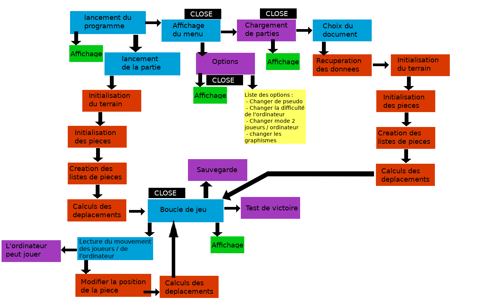

# projet-echec-et-pat

Projet scolaire, toute participation de mes collègues de l'EIL est la bienvenue  :+1:

Voici une representation rapide de ce que l'on doit faire (première version):

Il ne reste plus qu'à faire la distribution des rôles

Je rappel que ce que l'on met ici peut etre vu par n'importe quel personne voulant voir ce que l'on fait (pour récupérer des astuces de code par exemple). Ce qui me semble normal, sauf si vous tenez à ce que notre travail ne soit pas *libre de droit*.   Dans tous les cas, ne mettez pas d'information sensible à la vue de tout le monde.

